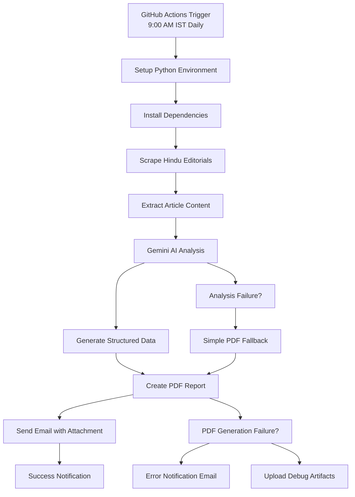

# 🚀 Hindu Editorial Analyzer

[](https://python.org)
[](/.github/workflows/report.yml)
[](LICENSE)

> **Transform Your CAT VARC Preparation with AI-Powered Editorial Analysis**

An intelligent, fully automated system that scrapes The Hindu editorial articles, analyzes them using Google Gemini AI, generates comprehensive PDF reports, and delivers them to your inbox daily. Designed specifically for CAT VARC (Verbal Ability and Reading Comprehension) exam preparation.

## 🎯 Project Vision

**Revolutionize CAT preparation** by providing consistent, high-quality editorial analysis that builds reading comprehension skills, expands vocabulary, and sharpens critical thinking abilities - all delivered automatically to your inbox every morning.

## ✨ Core Features

### 🤖 **Fully Automated Workflow**
- **Daily Automation**: GitHub Actions runs analysis at 9:00 AM IST
- **Smart Scraping**: Extracts fresh editorial content from The Hindu
- **AI Analysis**: Google Gemini provides comprehensive insights
- **PDF Generation**: Professional reports with structured analysis
- **Email Delivery**: Automatic email with PDF attachment

### � **CAT VARC-Focused Analysis**
- **Central Idea Extraction**: 2-3 line summaries of main arguments
- **Tone Analysis**: Author's perspective (critical, analytical, persuasive, etc.)
- **Paragraph Breakdown**: Structured paragraph-wise summaries
- **Vocabulary Building**: 4-8 advanced words with meanings and examples
- **Critical Thinking**: Inference and comprehension questions
- **Key Takeaways**: Reading strategy tips for exam preparation

### 🔧 **Robust Architecture**
- **Error Handling**: Graceful fallbacks and failure notifications
- **Multiple Formats**: Detailed and simple PDF generation options
- **Scalable**: Supports 1-5 articles per analysis session
- **Monitored**: Comprehensive logging and debugging capabilities

## 🏗️ Project Architecture

```
thehindu_exct/
├── 📄 main.py                     # Core orchestration & PDF generation
├── 📧 mail_send.py                # Email automation system
├── 📋 requirements.txt            # Python dependencies
├── ⚙️ pyproject.toml              # Project configuration
├── 📖 README.md                   # Project documentation
├── 📝 GITHUB_ACTIONS_SETUP.md     # Automation setup guide
│
├── 🤖 .github/workflows/
│   └── report.yml                 # GitHub Actions automation
│
├── 📜 scripts/
│   ├── scrapper.py               # Hindu editorial web scraping
│   └── gemini.py                 # Gemini AI integration & analysis
│
├── 🛠️ utils/
│   └── prompt_updated.py         # CAT VARC-optimized AI prompts
│
└── 📁 logs/                      # Generated PDF reports
```

## � Complete Workflow



## 🚀 Quick Start

### 🔧 **Local Development**

1. **Clone & Setup**
   ```bash
   git clone https://github.com/RishabhBansal22/hindu-analyzer.git
   cd hindu-analyzer
   pip install -r requirements.txt
   ```

2. **Environment Configuration**
   ```bash
   # Create .env file
   echo "GEMINI_API_KEY=your_gemini_api_key" > .env
   echo "sender_mail=your@gmail.com" >> .env
   echo "reciever_mail=recipient@email.com" >> .env
   echo "gmail_app_pass=your_app_password" >> .env
   ```

3. **Run Analysis**
   ```bash
   # Analyze 2 articles (default)
   python main.py
   
   # Or run with email sending
   python mail_send.py
   ```

### 🤖 **Automated Setup (Recommended)**

For fully automated daily reports, follow the **[GitHub Actions Setup Guide](GITHUB_ACTIONS_SETUP.md)**

**Required GitHub Secrets:**
- `SENDER_MAIL`: Gmail address for sending
- `RECEIVER_MAIL`: Email to receive reports  
- `GMAIL_APP_PASS`: Gmail App Password
- `GEMINI_API_KEY`: Google Gemini API key

## 📊 Analysis Output Structure

### **JSON Analysis Format**
```json
{
  "session_info": {
    "timestamp": "2024-10-11T09:00:00",
    "total_articles": 2,
    "analysis_status": "completed"
  },
  "articles_analysis": [
    {
      "article_info": {
        "number": 1,
        "title": "Editorial Title",
        "url": "https://thehindu.com/...",
        "status": "success"
      },
      "gemini_analysis": {
        "central_idea": "Main argument summary...",
        "tone_of_author": "analytical",
        "paragraph_wise_summary": ["Para 1...", "Para 2..."],
        "vocabulary_builder": [
          {
            "word": "efficacious",
            "meaning": "effective in producing result",
            "example_usage": "The new policy proved efficacious."
          }
        ],
        "critical_thinking_questions": [
          {
            "question": "What assumptions does the author make?",
            "question_type": "assumptions"
          }
        ],
        "takeaway": "Focus on connecting ideas across paragraphs..."
      }
    }
  ]
}
```

### **PDF Report Features**
- **Professional Layout**: Clean, readable format with proper styling
- **Table of Contents**: Easy navigation between articles
- **Original Content**: Full editorial text for reference
- **Structured Analysis**: All insights in organized sections
- **Vocabulary Tables**: Words, meanings, and examples in table format
- **Print-Ready**: Optimized for both digital and physical reading

## 🛠️ Technology Stack

| Component | Technology | Purpose |
|-----------|------------|---------|
| **Web Scraping** | `requests` + `BeautifulSoup4` | Extract Hindu editorial content |
| **AI Analysis** | `google-genai` (Gemini 2.5 Flash) | Comprehensive text analysis |
| **Data Validation** | `pydantic` | Structured output validation |
| **PDF Generation** | `reportlab` | Professional report creation |
| **Email Automation** | `smtplib` + `EmailMessage` | Gmail SMTP integration |
| **Task Automation** | **GitHub Actions** | Daily scheduling & execution |
| **Environment Management** | `python-dotenv` | Secure credential handling |

## ⚙️ Configuration Options

### **Analysis Parameters**
```python
# In main.py or workflow
result = main(num_articles=3)  # Analyze 1-5 articles
```

### **Schedule Customization**
```yaml
# In .github/workflows/report.yml
schedule:
  - cron: '30 3 * * *'  # 9:00 AM IST daily
```

### **Email Customization**
```python
# In mail_send.py
msg["Subject"] = "Custom Subject"
msg.set_content("Custom email content...")
```

## 📈 Use Cases & Benefits

### **For CAT Aspirants**
- ✅ **Daily Practice**: Consistent exposure to high-quality editorial content
- ✅ **Vocabulary Building**: Systematic expansion of advanced vocabulary
- ✅ **Comprehension Skills**: Regular practice with structured analysis
- ✅ **Time Management**: No manual effort required for content gathering
- ✅ **Progress Tracking**: Historical reports for performance analysis

### **For Educators**
- ✅ **Teaching Material**: Ready-made content for classroom discussions
- ✅ **Assignment Generation**: Critical thinking questions for students
- ✅ **Curriculum Support**: Systematic coverage of current affairs
- ✅ **Skill Assessment**: Structured framework for evaluation

### **For Content Creators**
- ✅ **Research Automation**: Daily insights from quality journalism
- ✅ **Trend Analysis**: Systematic tracking of editorial themes
- ✅ **Content Inspiration**: Ideas for blogs, videos, and discussions

## 🔮 Roadmap & Future Enhancements

### **Phase 1: Enhanced Analysis** ⏳
- [ ] Multi-source scraping (Indian Express, Economic Times)
- [ ] Sentiment analysis integration
- [ ] Historical trend tracking
- [ ] Custom difficulty levels

### **Phase 2: Advanced Features** 🎯
- [ ] Web dashboard for report management
- [ ] Mobile app notifications
- [ ] Collaborative sharing features
- [ ] Progress analytics dashboard

### **Phase 3: AI Enhancement** 🚀
- [ ] Personalized difficulty adaptation
- [ ] Interactive Q&A generation
- [ ] Performance-based recommendations
- [ ] Multi-language support

## 🤝 Contributing

We welcome contributions! Here's how to get involved:

1. **Fork the repository**
2. **Create feature branch**: `git checkout -b feature/amazing-feature`
3. **Make your changes**: Follow our coding standards
4. **Add tests**: Ensure your changes are well-tested
5. **Submit PR**: Detailed description of changes

### **Development Areas**
- 🔧 **Core Features**: Scraping, analysis, PDF generation
- 🤖 **AI Enhancement**: Prompt engineering, model optimization
- 📱 **User Experience**: Dashboard, mobile app, notifications
- 🧪 **Testing**: Unit tests, integration tests, performance tests

## � License & Disclaimer

This project is licensed under the **MIT License** - see [LICENSE](LICENSE) for details.

**Important Notes:**
- ✅ **Educational Purpose**: Designed for learning and exam preparation
- ✅ **Responsible Use**: Respects The Hindu's terms of service
- ✅ **Attribution**: Always credits original content sources
- ⚠️ **No Redistribution**: Analyzed content should not be redistributed commercially

## 🙏 Acknowledgments

- **The Hindu** - For consistently high-quality editorial content
- **Google Gemini** - For powerful AI analysis capabilities
- **GitHub Actions** - For reliable automation infrastructure
- **CAT Community** - For inspiration and continuous feedback
- **Open Source** - For tools and libraries that make this possible

## 📞 Support & Contact

- 🐛 **Issues**: [GitHub Issues](https://github.com/RishabhBansal22/hindu-analyzer/issues)
- 📖 **Documentation**: [Setup Guide](GITHUB_ACTIONS_SETUP.md)
- 💬 **Discussions**: [GitHub Discussions](https://github.com/RishabhBansal22/hindu-analyzer/discussions)
- 📧 **Email**: Contact via GitHub profile

---

<div align="center">

**🎯 Master CAT VARC with AI-Powered Daily Practice! 🚀**

*Star ⭐ this repository if it helps your CAT preparation!*

[](https://star-history.com/#RishabhBansal22/hindu-analyzer&Date)

</div>